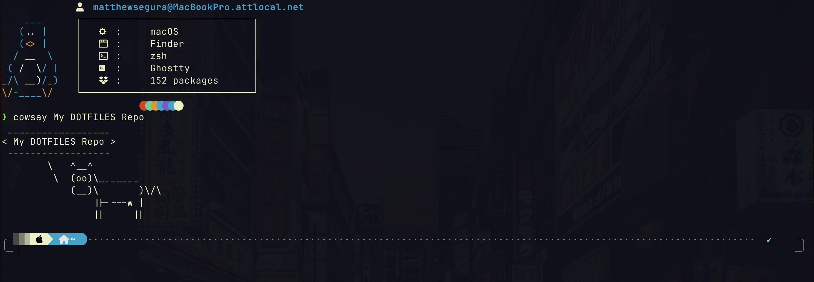

#


# My MacOS Dotfiles

Welcome to my personal dotfiles! If you are here for inspiration for how my terminal looks, check out my .zshrc and terminal section for more info.

---

## Steps (If I didn't make this I would forget) 

### 1. Install Homebrew

```sh
/bin/bash -c "$(curl -fsSL https://raw.githubusercontent.com/Homebrew/install/HEAD/install.sh)"
```

### 2. Clone This Repo

```sh
git clone https://github.com/FloorMatt89/dotfiles.git ~/.dotfiles
cd ~/.dotfiles
```

### 3. Install Dependencies with Homebrew

```sh
brew bundle
```

This reads from the `Brewfile` and installs:

- CLI tools (`bat`, `fd`, `fzf`, `ripgrep`, etc.)
- GUI apps via cask (`ghostty`, `alt-tab`, `ngrok`, etc.)
- VS Code extensions

---

## Setup with `stow`

This repo uses GNU Stow to manage symlinks for config files.

### 1. Install Stow (if not already)

```sh
brew install stow
```

### 2. Stow Your Configs

From the `.dotfiles` directory:

```sh
stow zsh
stow nvim
stow tmux
stow git
sudo stow --target=/usr/local/bin bin  # This includes custom scripts like the penguin image you see above
```

### To Unstow a Folder

```sh
stow -D bin
```

---

## Manual Setup (Without Stow)

If you'd rather symlink manually, here are some examples of linking:

```sh
ln -s ~/.dotfiles/zsh/.zshrc ~/.zshrc
ln -s ~/.dotfiles/nvim ~/.config/nvim
ln -s ~/.dotfiles/bin/diyfetch /usr/local/bin/diyfetch
```

---

## Terminal Aesthetics 🤺

### 1. Powerlevel10k
- This is theme I use for my Terminal 
- My theme install included via `.p10k.zsh`
- Ensure the theme is sourced in `.zshrc`:

```sh
ZSH_THEME="powerlevel10k/powerlevel10k"
[[ ! -f ~/.p10k.zsh ]] || source ~/.p10k.zsh
```


- If you want to your own theme with Powerlevel10k but not mine(rude), simply do not link .p10k.zsh and your terminal should prompt configuration setup.

### 2. Nerd Fonts

Install a patched Nerd Font from [https://www.nerdfonts.com/](https://www.nerdfonts.com/) (for instance I use Firacode mono) and set it as your terminal font. If you use my ghostty config, firacode should already be configured.

### 3. Oh My Zsh

```sh
sh -c "$(curl -fsSL https://raw.githubusercontent.com/ohmyzsh/ohmyzsh/master/tools/install.sh)"
```

Ensure `~/.oh-my-zsh` is tracked or document separately for reproducibility.

---

## File Structure

```
.dotfiles/
├── bin/
│   └── diyfetch
├── zsh/
│   └── .zshrc
├── nvim/
│   └── ...
├── tmux/
│   └── .tmux.conf
├── git/
│   └── .gitconfig
├── Brewfile
└── README.md
```

---

